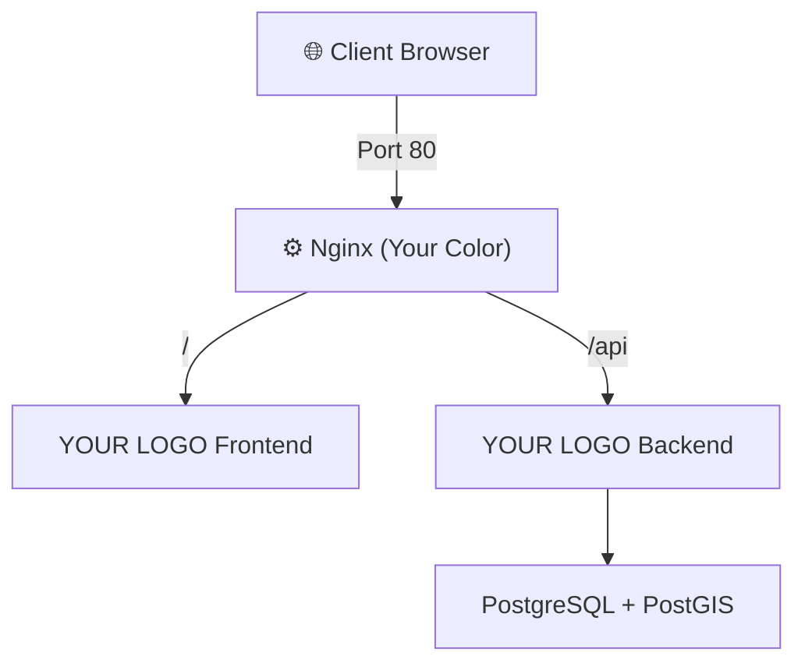

# Architecture Diagram Guide - How to Understand & Present to Clients

## 📚 Overview

This guide explains each architecture diagram and helps you present them to clients in a way that's both technical enough for developers and accessible for business stakeholders.

---

## 🎯 Guide 1: Main System Architecture Diagram

### What It Shows
This is the **"big picture"** diagram showing:
- Where your application lives (on a server)
- How client devices connect
- The 4 main services working together
- How data flows through the system

### Reading from Outside to Inside

```
┌─ Outside the Server (Client side)
│  └─ Browser at 192.168.120.65
│     └─ Sends request on Port 80
│
├─ Outside to Inside (Network layer)
│  └─ Port 80 is the single entry point
│
├─ Inside the Server (Docker network)
│  └─ 4 containers on internal network
│     ├─ Nginx: Routes requests to correct service
│     ├─ Frontend: Shows user interface
│     ├─ Backend: Processes business logic
│     └─ Database: Stores all data
│
└─ Data Movement
   └─ Frontend ↔ Backend ↔ Database
```

### What to Tell Your Client

**Simple Version (for non-technical stakeholders):**

> *"Your application runs on a single server. When users visit your website, all traffic passes through a single entry point (Port 80), then gets routed to the right service. The user interface is separate from the logic layer, which is separate from the data storage. This separation makes it more secure, faster, and easier to maintain."*

**Technical Version (for developers):**

> *"The system uses a containerized microservices architecture. Nginx acts as a reverse proxy, routing requests based on URL paths. Frontend and Backend are containerized, allowing for horizontal scaling. PostgreSQL with PostGIS provides spatial data capabilities. All services communicate over a Docker bridge network with internal DNS resolution."*

---

## 🔍 Guide 2: Component Interaction Diagram

### Understanding Each Component

#### **Nginx (The Bouncer)**
```
Role: Traffic director
Job: Listen on port 80 and decide where requests go
Rule: "/" → Frontend, "/api/*" → Backend
Benefit: Single entry point, load balancing ready
```

#### **Frontend (The Face)**
```
Role: User interface
Technology: Next.js (React framework)
Job: Show forms, buttons, maps, images
Port: 3000 (internal)
Benefit: Can update UI without touching backend
```

#### **Backend (The Brain)**
```
Role: Business logic & API
Technology: FastAPI (Python framework)
Job: Process registration, fetch shops, manage data
Port: 8000 (internal)
Benefit: Can change logic without affecting UI
```

#### **Database (The Memory)**
```
Role: Data storage
Technology: PostgreSQL + PostGIS
Job: Remember users, shops, locations
Port: 5432 (internal)
Benefit: With PostGIS, can do geographic queries
```

### Communication Diagram

```
User Browser
    ↓ "What do I request?"
Nginx - "Is it for website or API?"
    ├→ Website request? → Frontend (shows HTML/CSS/JS)
    └→ API request? → Backend (processes and returns JSON)

Backend needs data:
    ↓ "Query from database"
Database - "Here's your data"
    ↓
Backend - "Format as JSON"
    ↓
Nginx - "Send back to user"
    ↓
Browser - "Display on screen"
```

---

## 📊 Guide 3: Request/Response Flow Diagrams

### User Registration Flow Explained

**What happens when user clicks "Register"?**

| Step | Component | Action | Duration |
|------|-----------|--------|----------|
| 1 | Browser | Creates form data (email, password) | instant |
| 2 | Browser | Sends POST request to /api/auth/register | instant |
| 3 | Network | Packet travels to server on Port 80 | ~1-50ms |
| 4 | Nginx | Receives request, checks URL | ~1ms |
| 5 | Nginx | Routes to Backend (sees /api/) | ~1ms |
| 6 | Backend | Receives request, validates input | ~5ms |
| 7 | Backend | Hashes password (secure encryption) | ~100ms |
| 8 | Backend | Creates database INSERT query | ~1ms |
| 9 | Database | Receives query, validates | ~1ms |
| 10 | Database | Checks if email already exists | ~5ms |
| 11 | Database | Inserts user record | ~10ms |
| 12 | Database | Returns success + user ID | ~1ms |
| 13 | Backend | Creates JWT token (secure key) | ~5ms |
| 14 | Backend | Formats JSON response | ~1ms |
| 15 | Backend | Sends response to Nginx | instant |
| 16 | Nginx | Forwards to Browser | ~1ms |
| 17 | Browser | Receives JSON with user ID & token | ~1-50ms |
| 18 | Browser | Stores token in local storage | instant |
| 19 | Browser | Redirects to login page | instant |
| **Total** | **All** | **User sees success** | **~150-200ms** |

### Key Insights to Share

📌 **Why So Fast?**
- No human waits longer than 2 seconds
- Your system responds in ~200ms
- All components optimized for speed

📌 **Where Is Security?**
- Password hashed (can't be reversed)
- JWT token issued (proves user is authentic)
- Only stored user ID, never password

📌 **Where Is Data Stored?**
- Password hash in PostgreSQL
- User ID returned to browser
- Token stored in browser memory

---

## 🗺️ Guide 4: Port Mapping Architecture

### Understanding Ports

**Analogy: Apartment Building**
```
192.168.120.65 = Building address
Port 80 = Front door (everyone enters here)
Port 3000 = The restaurant in the building (internal)
Port 8000 = The office in the building (internal)
Port 5432 = The storage room in the building (internal)
```

### Port Traffic Flow

**External World Sees:**
```
http://192.168.120.65  ← Browser can only access port 80
http://192.168.120.65:8000  ← BLOCKED (port 8000 not exposed)
http://192.168.120.65:5432  ← BLOCKED (port 5432 not exposed)
```

**Inside Docker Network Sees:**
```
Frontend at 172.18.0.4:3000   ← Can reach
Backend at 172.18.0.3:8000    ← Can reach
Database at 172.18.0.5:5432   ← Can reach
All via internal DNS names    ← Works perfectly
```

### Why This Design?

✅ **Security:**
- Database never exposed to internet
- Backend not directly accessible
- Single firewall point (Port 80)

✅ **Flexibility:**
- Can swap backend without changing frontend
- Can move database to different machine
- Each service independent

✅ **Performance:**
- Nginx caches responses
- Internal DNS is fast
- Services communicate efficiently

---

## 🔄 Guide 5: Service Dependencies Diagram

### The Startup Sequence

**Think of it like opening a restaurant:**

```
Step 1: Open storage room (Database)
        └─ "Is the freezer working?" (health check)
        └─ Wait until it's ready

Step 2: Open kitchen (Backend)
        └─ Needs storage room (Database) to work
        └─ "Can I connect to storage?" 
        └─ If yes, continue. If no, restart

Step 3: Open dining area (Frontend)
        └─ Depends on kitchen
        └─ "Is kitchen accepting orders?"
        └─ If yes, continue

Step 4: Open front door (Nginx)
        └─ Only when all are ready
        └─ Now customers can enter
```

### Health Checks

**What's a Health Check?**

```
Like checking if someone is awake before assigning work

Database health check:
  ↓ "Is PostgreSQL responding?"
  ↓ Every 10 seconds, try: pg_isready
  ↓ If yes: healthy ✅
  ↓ If no: unhealthy ❌ → Try restart
```

---

## 🌐 Guide 6: Environment Variables Flow

### What Are Environment Variables?

**Simple Analogy:**
```
Like a locked note that contains:
- Database password
- Server addresses
- Configuration settings

Each service gets only the notes it needs:

Backend note contains:
  - Database URL: postgresql://...
  - How to connect to PostgreSQL

Frontend note contains:
  - Backend URL: http://192.168.120.65/api
  - Where to send API requests

Database note contains:
  - Admin username
  - Admin password
  - Database name
```

### Why Not Hardcode?

❌ **Bad (Hardcoded):**
```javascript
// In code
const dbUrl = "postgresql://user:password@db:5432/gis_portal"
```
Problem: Everyone sees password, can't change without recompiling

✅ **Good (Environment Variable):**
```javascript
// In code
const dbUrl = process.env.DATABASE_URL
```
Problem solved: Password in .env file, code is same everywhere

### Environment Files

```
.env           ← Active file (gitignored, secret)
.env.local     ← Template for local development
.env.docker    ← Template for Docker development
.env.server    ← Template for server deployment
```

**Workflow:**
1. Copy template: `cp .env.server .env`
2. Edit with your values: `nano .env`
3. Docker-compose reads it automatically
4. Containers run with those values

---

## 🎓 Guide 7: How to Present to Different Audiences

### Presentation 1: For Business/Non-Technical Client

**Keep It Simple:**

> "Your GIS Coffee Locator Portal is like a library system:
>
> - **Nginx** = Librarian at front desk (directs you)
> - **Frontend** = Reading room (where you interact)
> - **Backend** = Data management (processes requests)
> - **Database** = Library shelves (stores books/data)
>
> Users visit once at port 80. Nginx figures out what they need and gives them the right service. Fast, secure, and scalable."

**Key Points:**
- Single entry point (Port 80)
- Four independent services working together
- Can upgrade each service without affecting others
- Runs on your own server (you control the data)

### Presentation 2: For Technical Team

**Technical Depth:**

> "Architecture: Containerized microservices using Docker Compose.
>
> - **Nginx**: Reverse proxy with path-based routing
> - **Frontend**: Next.js 14 with TailwindCSS (production build)
> - **Backend**: FastAPI with async request handling
> - **Database**: PostgreSQL 17 with PostGIS 3.4
> - **Network**: Docker bridge (gis-network) with internal DNS
>
> Authentication: JWT tokens, password hashing with bcrypt
> Spatial Queries: PostGIS for geographic distance calculations
> Deployment: Single docker-compose file, environment-based config"

**Key Points:**
- Container-native design (12-factor principles)
- Async request handling for performance
- Separation of concerns (SOLID principles)
- Ready for horizontal scaling

### Presentation 3: For Stakeholders (Investors, Managers)

**Business-Focused:**

> "Our architecture provides:
>
> **Reliability**: No single point of failure for each component
> **Scalability**: Can add more servers without rewriting code
> **Maintainability**: Each team can work independently
> **Security**: Private database, single public entry point
> **Cost-Effectiveness**: Uses open-source, no vendor lock-in"

---

## 📈 Guide 8: Scaling Explanation

### Current State (What You Have)
```
Single Server 192.168.120.65
┌─────────────────────┐
│ Docker Compose      │
│ ├─ Nginx            │
│ ├─ Frontend         │
│ ├─ Backend          │
│ ├─ Database         │
│ └─ Shared storage   │
└─────────────────────┘

Capacity: ~1,000 users/day
```

### Future State (When You Grow)
```
Multiple Servers
┌──────────────────┐     ┌──────────────────┐
│ Server 1         │     │ Server 2         │
│ ├─ Frontend      │     │ ├─ Frontend      │
│ ├─ Backend       │     │ ├─ Backend       │
└──────────────────┘     └──────────────────┘
         ↑                        ↑
         └────────┬──────────────┘
                  │
         ┌────────▼───────┐
         │ Load Balancer  │
         │ (Nginx or HAProxy)
         └────────────────┘
                  ↑
         ┌────────┴────────┐
         │ Shared Database │
         │ PostgreSQL      │
         └─────────────────┘

Capacity: ~10,000+ users/day
```

### How to Transition
"Your current setup is 80% ready for scaling. We just need to:
1. Move database to managed service (AWS RDS)
2. Create multiple backend/frontend instances
3. Add load balancer
4. Configure auto-scaling rules"

---

## 🎨 Guide 9: Creating Custom Diagrams

### Tools You Can Use

**Online Tools (No Installation):**
- [mermaid.live](https://mermaid.live) - Draw diagrams online
- [draw.io](https://draw.io) - Professional diagrams
- [Lucidchart](https://lucidchart.com) - Enterprise diagrams

**Export Diagrams:**
1. Go to [mermaid.live](https://mermaid.live)
2. Copy content from ARCHITECTURE_VISUAL_DIAGRAMS.md
3. Paste into mermaid.live
4. Click Export → PNG/SVG/PDF
5. Share with clients

**VS Code:**
- Install "Markdown Preview Mermaid Support" extension
- Diagrams render automatically in preview

### Customizing for Your Client

**Add Your Branding:**


**Simplify for Executives:**
- Remove technical jargon
- Use business terms
- Focus on benefits (speed, security, scalability)

---

## 🔒 Guide 10: Security Architecture

### Data Flow (With Security Layers)

```
Browser Request
    ↓
[Port 80 - Only Entry Point]
    ↓
Nginx [Rate limiting, CORS check]
    ↓
Is it /api/? [Authentication check]
    ├→ JWT token valid? YES → Pass to Backend
    └→ JWT token valid? NO → Return 401 Unauthorized
    ↓
Backend [Input validation with Pydantic]
    ↓
Database [SQL injection prevention with prepared statements]
    ↓
Result [Secure HTTPS response]
    ↓
Browser [Stores token securely]
```

### What's Protected

| Data | Protection | How |
|------|-----------|-----|
| Passwords | Bcrypt hashing | One-way encryption |
| Sessions | JWT tokens | Signed, expiring keys |
| Connections | HTTPS ready | Can add SSL (currently HTTP) |
| Database | Private IP | 172.18.0.5 not exposed |
| API Keys | Environment vars | Not in code repository |

---

## 📋 Guide 11: Troubleshooting Guide

### Common Issues & Where They Appear on Diagram

**Issue: Website shows 502 Bad Gateway**
📍 Location: Nginx ↔ Backend connection
✅ Solution: Check if backend container is healthy
```bash
sudo docker-compose ps
sudo docker-compose logs backend
```

**Issue: Map won't load shops**
📍 Location: Frontend → Backend → Database connection
✅ Solution: Check API URL config
```bash
curl http://localhost:8000/api/shops
```

**Issue: Database says "connection refused"**
📍 Location: Backend ↔ Database connection
✅ Solution: Verify DATABASE_URL in backend/.env
```bash
sudo docker-compose logs db
```

**Issue: User registration hangs**
📍 Location: Database is slow
✅ Solution: Check database health
```bash
sudo docker exec gis-portal-db pg_isready
```

---

## ✨ Guide 12: Key Talking Points for Clients

### Reliability
> "If one component fails, the others keep working. For example, if we update the user interface (Frontend), the map (Backend) keeps running. Users don't experience downtime."

### Performance
> "Geographic queries are optimized with PostGIS spatial indexes. Finding all coffee shops within 5km takes milliseconds, not seconds. Users see real-time results."

### Security
> "Your database is completely hidden from the internet. User passwords are encrypted. Only the website interface is exposed. This is enterprise-grade security."

### Future-Proof
> "Need more features? We can add them without redesigning. Need more capacity? We can scale horizontally. Need to move to cloud? Everything is containerized."

### Cost-Effective
> "Built on open-source technologies (no licensing). Runs efficiently on modest hardware. Can grow without proportional cost increases."

---

## 🚀 Guide 13: Presenting the Diagram

### Recommended Sequence

**1. Start with the big picture**
Show main system architecture diagram (outside browser → inside containers)

**2. Explain the flow**
"When a user visits, here's what happens..."
Show request/response flow diagram

**3. Break down components**
"Let me show you each piece..."
Component interaction diagram

**4. Address concerns**
"Let's talk about scalability..."
Show scaling diagram

**5. Discuss security**
"Here's how we protect your data..."
Show security architecture

**6. Answer questions**
Have troubleshooting diagram ready

---

## 📑 File Organization for Client Delivery

**Send These Files:**
```
📦 Project Documentation
├── README.md (overview)
├── ARCHITECTURE_SUMMARY.md (this guide)
├── ARCHITECTURE_DIAGRAMS.md (text diagrams)
├── ARCHITECTURE_VISUAL_DIAGRAMS.md (mermaid diagrams)
├── COMPLETE_DOCUMENTATION.md (technical details)
├── ENV_SETUP_GUIDE.md (environment config)
└── SERVER_DEPLOYMENT_GUIDE.md (deployment)
```

**Export & Present:**
1. Export diagrams from mermaid.live as PNG/PDF
2. Create PowerPoint slides with diagrams + bullets
3. Share documentation for reference
4. Keep source (mermaid) for future changes

---

## ✅ Summary

### For Non-Technical Clients:
→ Focus on: Reliability, Security, Scalability
→ Diagram: Main Architecture only
→ Time: 5-10 minutes

### For Technical Teams:
→ Focus on: Technology choices, Design patterns
→ Diagrams: All diagrams, code examples
→ Time: 30-45 minutes

### For Mixed Audiences:
→ Start simple, go deep on request
→ Use component diagram as reference
→ Have all resources ready

---

**ProTip**: Make a copy of the diagrams, customize with your branding/colors, and keep updated as your architecture evolves. This becomes your technical reference document for the next 2+ years!

