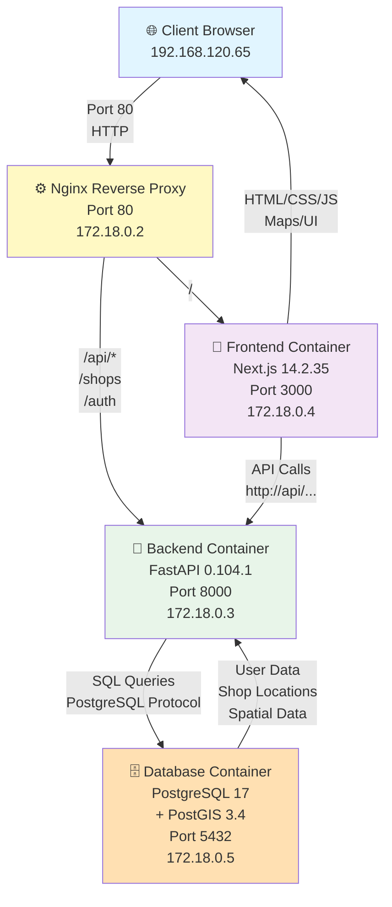
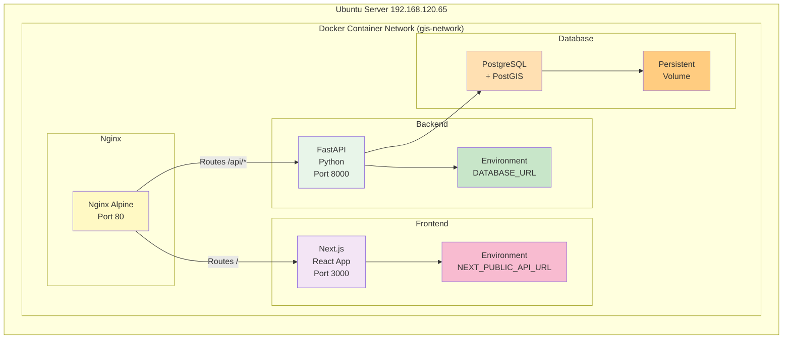
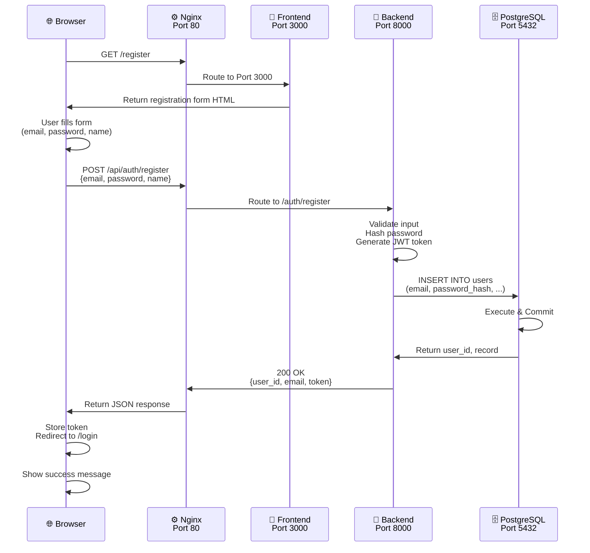
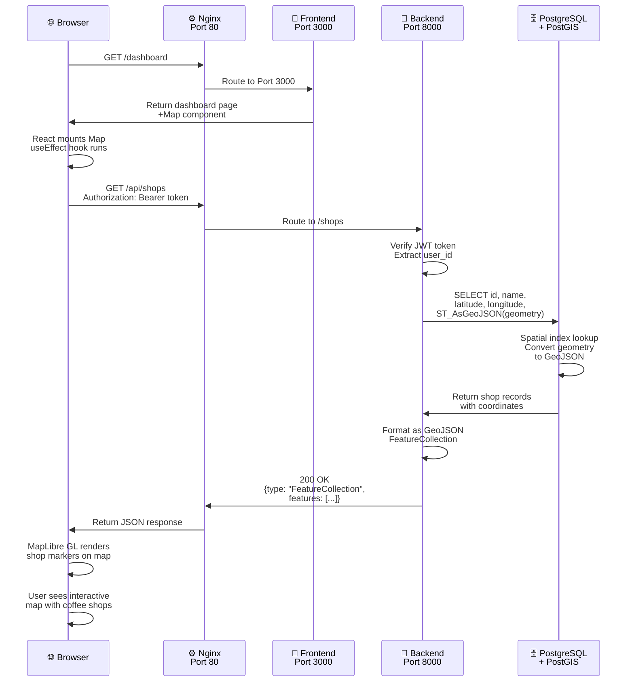
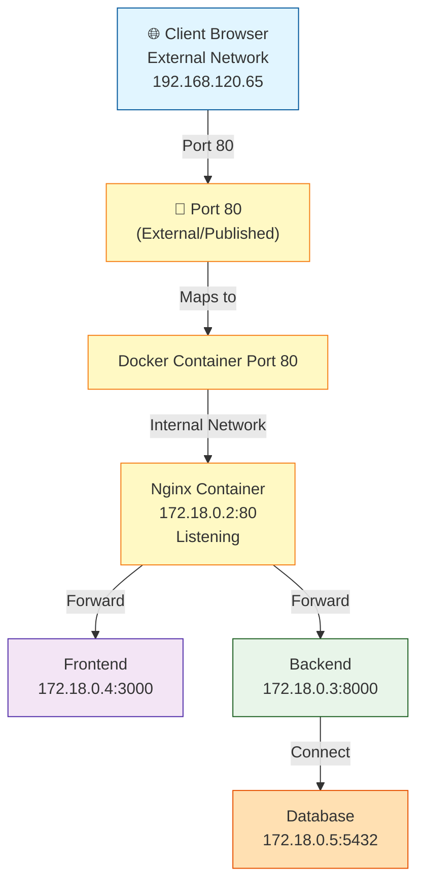
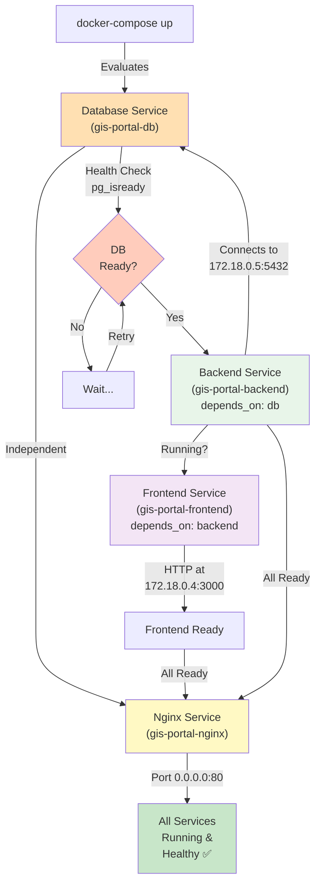
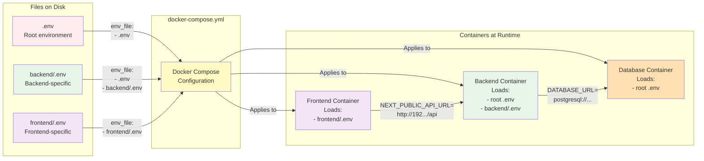
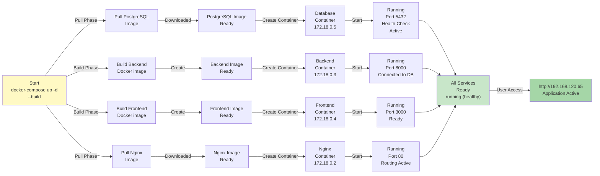
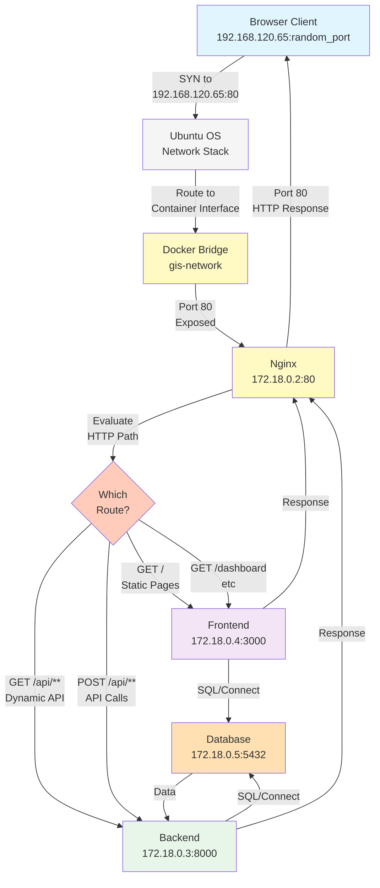

# Visual Architecture Diagrams (Mermaid)

## System Architecture Diagram

---

## Detailed Component Interaction Diagram

---

## Data Flow: Registration Process

---

## Data Flow: Map Data Loading

---

## Port Mapping Architecture

---

## Service Dependencies

---

## Environment Variable Flow

---

## Complete Request/Response Cycle

```mermaid
graph TB
    A["1️⃣ User in Browser<br/>at 192.168.120.65"]
    B["2️⃣ Browser makes request<br/>POST /api/auth/register"]
    C["3️⃣ Network packet<br/>Port 80"]
    D["4️⃣ Server receives<br/>on Port 80"]
    E["5️⃣ Nginx container<br/>accepts connection"]
    F["6️⃣ Nginx evaluates<br/>routing rules"]
    G["7️⃣ Match: /api/* →<br/>Backend:8000"]
    H["8️⃣ Internal network<br/>DNS: backend → 172.18.0.3"]
    I["9️⃣ Backend container<br/>receives on :8000"]
    J["🔟 FastAPI processes<br/>register route"]
    K["1️⃣1️⃣ Python validates<br/>hashes password"]
    L["1️⃣2️⃣ Backend connects<br/>to DB 172.18.0.5:5432"]
    M["1️⃣3️⃣ PostgreSQL<br/>executes INSERT"]
    N["1️⃣4️⃣ Returns user record<br/>+ JWT token"]
    O["1️⃣5️⃣ Backend formats<br/>JSON response"]
    P["1️⃣6️⃣ Nginx forwards<br/>response"]
    Q["1️⃣7️⃣ Browser receives<br/>JSON response"]
    R["1️⃣8️⃣ Frontend processes<br/>stores token"]
    S["1️⃣9️⃣ User redirected<br/>to login page"]
    T["✅ Success!"]
    
    A --> B --> C --> D --> E --> F --> G --> H --> I --> J --> K --> L --> M --> N --> O --> P --> Q --> R --> S --> T
    
    style A fill:#e1f5ff
    style T fill:#c8e6c9
    style M fill:#ffe0b2
```

---

## Docker Container Lifecycle

---

## Network & Routing Summary

---

## Summary Table: What Runs Where

| Component | Type | Image/Language | Port(s) | IP Address | Volume | Status |
|-----------|------|----------------|---------|-----------|--------|--------|
| **Nginx** | Container | nginx:alpine | 80:80 | 172.18.0.2 | nginx/default.conf | running |
| **Frontend** | Container | Node:20 + Next.js | 3000:3000 | 172.18.0.4 | None | running (healthy) |
| **Backend** | Container | Python:3.11 + FastAPI | 8000:8000 | 172.18.0.3 | None | running (healthy) |
| **Database** | Container | postgis/postgis:17-3.4 | 5432:5432 | 172.18.0.5 | postgres_data | running (healthy) |
| **Host OS** | Virtual Machine | Ubuntu 22.04 LTS | N/A | 192.168.120.65 | Server disk | running |

---

**For printable/shareable diagrams:** Export these mermaid diagrams using:
- [mermaid.live](https://mermaid.live) - Copy/paste content
- [mermaid.ink](https://mermaid.ink) - Create custom SVG URLs
- VS Code Mermaid Preview extension

